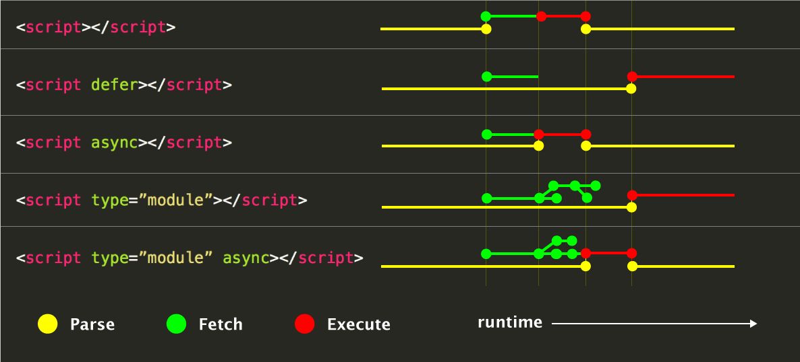

# clase-05

El ultimo commit es desde un fokr

## Ejercicios

* Van a crear los objetos de la clase pasada ahora tiene render
    - Video
    - Audio
    - Boton
    - Lista de elementos

* Crear un objeto formulario de ingreso que algunos componentes mencionados arriba.

## opcional
* Crear el objeto/class/componente input que si el ingreso de datos es incorrecto se ponga rojo sino amarillo y un check al costado.
    - Input
